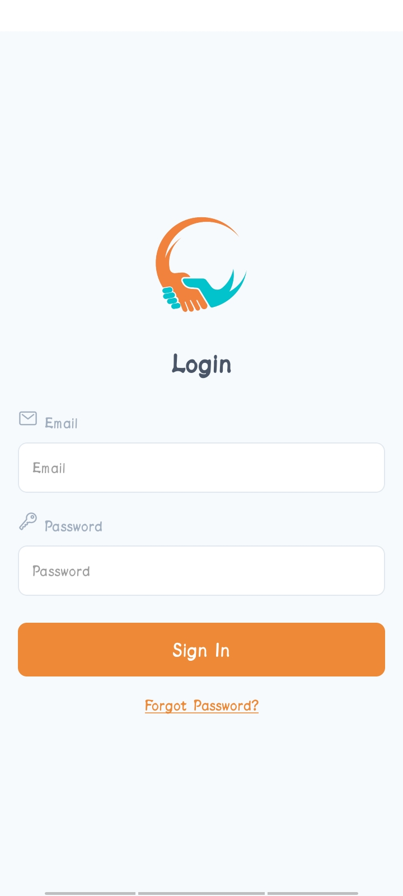
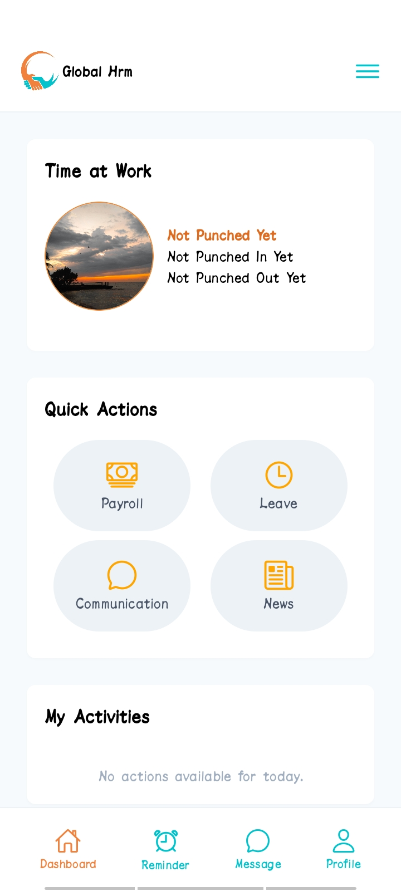
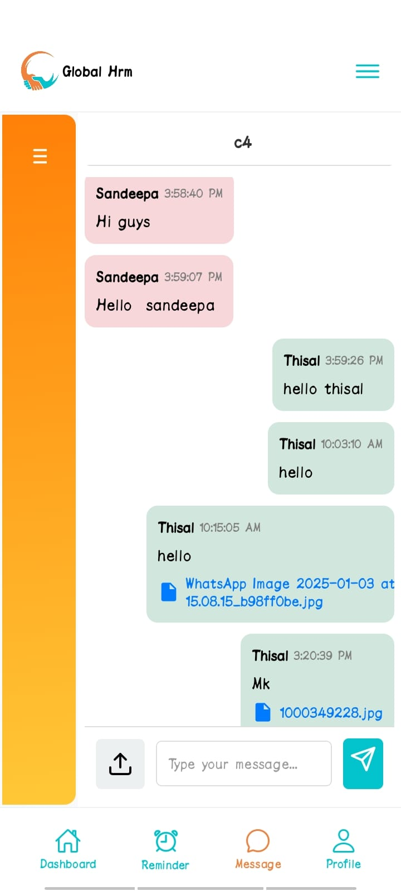
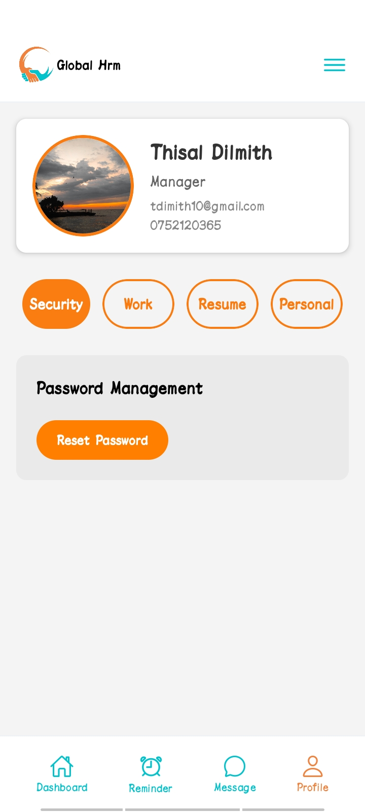
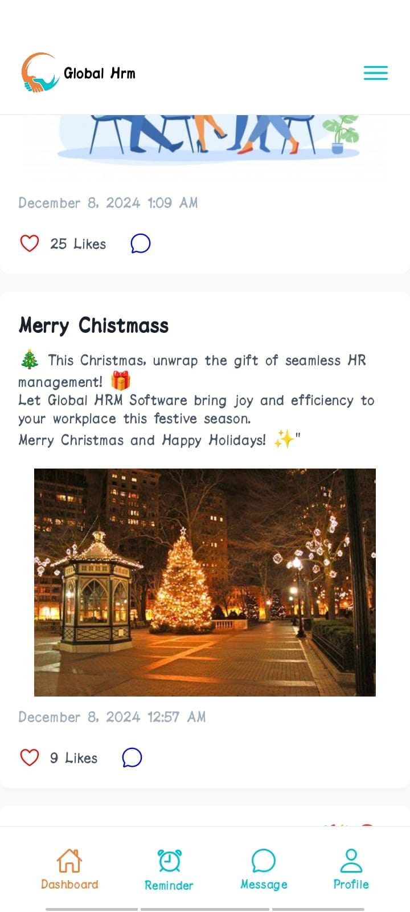
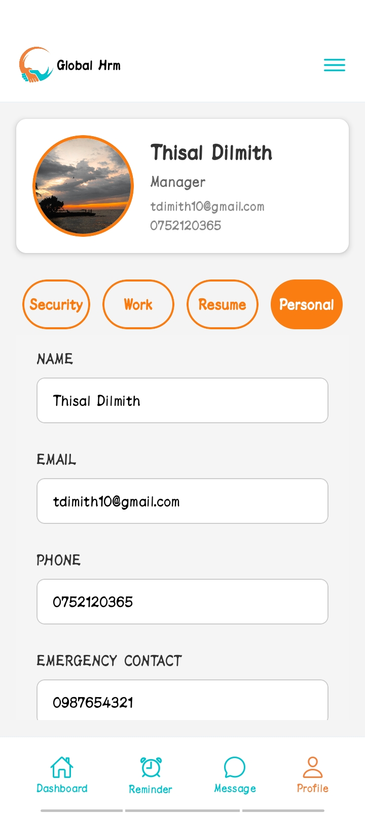
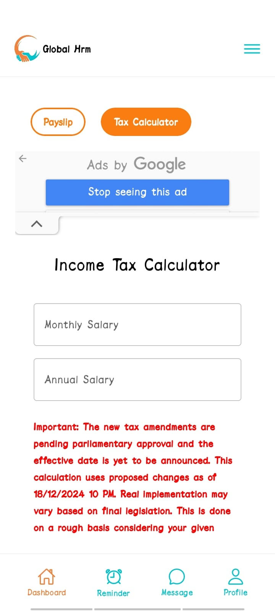
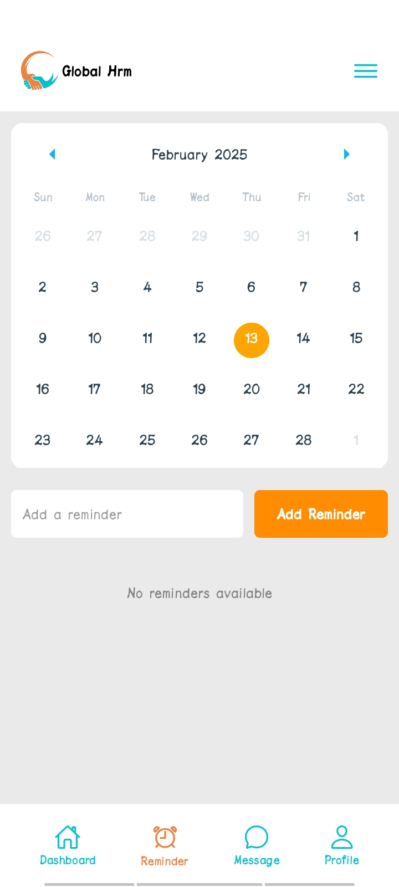

# 🌍 GLOBAL HRM Mobile Application

## Overview
GLOBAL HRM Mobile Application is a powerful and intelligent **Human Resource Management System** designed to help businesses efficiently manage their workforce. 
---

## 🌟 Features
- **Punch In & Out**: Seamlessly track employee working hours with an intuitive punch-in and punch-out system
- **Payroll System**: Automate payroll calculations, tax deductions, and salary disbursements.
- **Leaves & Attendance**: Manage leave requests, track attendance, and monitor absenteeism.
- **Communication System**: Enhance internal communication with an integrated messaging and collaboration platform.
- **Newsletter**: Share company updates, announcements, and newsletters through an integrated digital newspaper
- **My Activities**: Keep track of personal tasks, assignments, and work progress
- **My Reminders & Alerts**: Receive timely notifications for important tasks, deadlines, and company events.
- **My Profile**: Manage personal details, update information, and track performance records.

---

## 🛠️ Technologies Used
- **Frontend**: React.js, React Native (Expo)
- **Backend**: Node.js, Express.js
- **Database**: MySQL
- **Other Tools**: Sequelize, Axios, Bootstrap

---

## 🔧 Installation
1. Clone the repository:  
   ```bash
   git clone https://github.com/yourrepo/GLOBALHRM.git
   ```
2. Install dependencies for the server:
   ```bash
   cd server && npm install
   ```
3. Install dependencies for the client (web application):
   ```bash
   cd ../client && npm install
   ```
4. Install dependencies for the mobile application:
   ```bash
   cd ../mobile && npm install
   ```

---

## 🚀 Usage
1. Start the server:  
   ```bash
   cd ../server && npm start
   ```
2. Start the web client:
   ```bash
   cd ../client && npm start
   ```
3. Start the mobile app using Expo:
   ```bash
   cd ../mobile && expo start
   ```
4. Access the application at:
   - Web: http://localhost:3000
   - Mobile: Use Expo Go or an emulator to preview the app.

---

## 🙌 Contributors

Contributions to this project:

| Name               | GitHub Profile                          |
|--------------------|-----------------------------------------|
| Thisal | [@thisaldil](https://github.com/thisaldil)     |
| Sandeepa  | [@sandeepaMallawarachchi](https://github.com/sandeepaMallawarachchi) |
| Tashini | [@TasH-i](https://github.com/TasH-i) |


## 📸 Screenshots
<p align="center">
  
  
  
  
  
  
  
  
 
</p>


